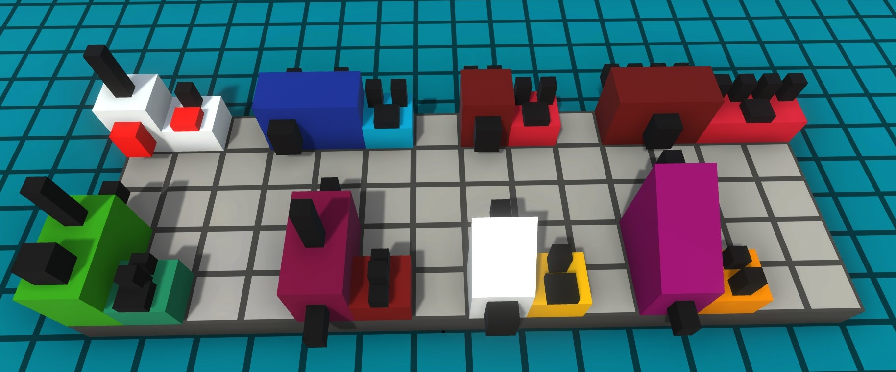
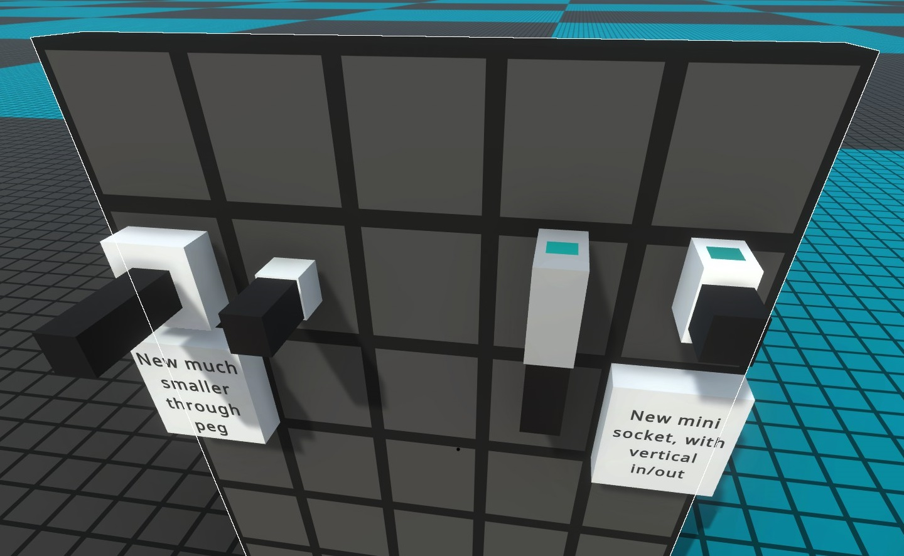
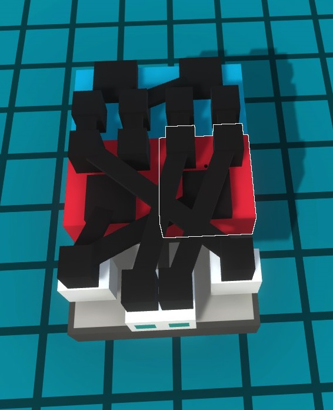

# LOOPS' Chiplets
!Mod made for public preview versions of 0.91.

Put simply this mod reshapes nearly every logic component in Logic World to fit within a 1 width cube, this means smaller components that can all tile together perfectly in a grid!

This mod also moves the inputs and outputs of every component to the top, this makes it much, much easier to build complex circuitry because all of the outputs and inputs are on the same level. 

Also includes a redesign of the vanilla ThroughPeg and the MiniSocket to be more ergonomic with the rest of the components.

# Circuit Example
Full adder using some of the new components.

# Install

Place the LC folder directly into LogicWorld/GameData, it should be directly beside the MHG folder and any other mods you have installed. 
